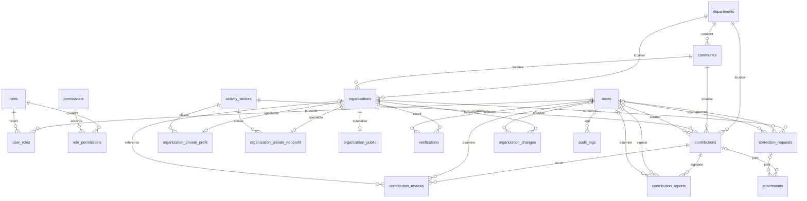

### Schéma relationnel mis à jour — types logiques

> Les identifiants utilisent `UUID`, les textes courts `VARCHAR`, les textes longs `TEXT`, les statuts `ENUM`, les dates `DATE`, les horodatages `TIMESTAMP`, les booléens `BOOLEAN` et les objets JSON `JSONB`.  
> Pour SQLite, ces types doivent être traduits vers ses types natifs et renforcés par des contraintes `CHECK`. Les fichiers restent stockés hors de la base.

users
- id UUID PK
- first_name VARCHAR(100) NOT NULL
- last_name VARCHAR(100) NOT NULL
- phone VARCHAR(30) UNIQUE
- email VARCHAR(254) UNIQUE
- password VARCHAR(255) NOT NULL
- status ENUM('active', 'suspended', 'disabled') NOT NULL
- created_at TIMESTAMP NOT NULL
- updated_at TIMESTAMP

roles
- id UUID PK
- name VARCHAR(100) UNIQUE NOT NULL
- description TEXT
- created_at TIMESTAMP NOT NULL

permissions
- id UUID PK
- name VARCHAR(100) UNIQUE NOT NULL
- description TEXT

user_roles
- id UUID PK
- user_id UUID FK -> users.id NOT NULL
- role_id UUID FK -> roles.id NOT NULL
- assigned_by UUID NULL FK -> users.id
- assigned_at TIMESTAMP NOT NULL
- UNIQUE (user_id, role_id)

role_permissions
- id UUID PK
- role_id UUID FK -> roles.id NOT NULL
- permission_id UUID FK -> permissions.id NOT NULL
- UNIQUE (role_id, permission_id)

departments
- id UUID PK
- name VARCHAR(150) UNIQUE NOT NULL

communes
- id UUID PK
- department_id UUID FK -> departments.id NOT NULL
- name VARCHAR(150) NOT NULL
- UNIQUE (department_id, name)

activity_sectors
- id UUID PK
- name VARCHAR(150) UNIQUE NOT NULL
- description TEXT
- status ENUM('active', 'inactive') NOT NULL

organizations
- id UUID PK
- name VARCHAR(255) NOT NULL
- type ENUM('private_profit', 'private_nonprofit', 'public') NOT NULL
- description TEXT
- department_id UUID FK -> departments.id
- commune_id UUID FK -> communes.id
- neighborhood VARCHAR(150)
- address TEXT
- phone VARCHAR(30)
- email VARCHAR(254)
- website VARCHAR(2048)
- status ENUM('draft', 'pending', 'published', 'suspended', 'archived') NOT NULL
- created_at TIMESTAMP NOT NULL
- updated_at TIMESTAMP NOT NULL
- published_at TIMESTAMP NULL

organization_private_profit
- id UUID PK
- organization_id UUID UNIQUE FK -> organizations.id NOT NULL
- ifu VARCHAR(100)
- rccm VARCHAR(100)
- legal_form VARCHAR(150)
- activity_sector_id UUID FK -> activity_sectors.id

organization_private_nonprofit
- id UUID PK
- organization_id UUID UNIQUE FK -> organizations.id NOT NULL
- raf_number VARCHAR(100)
- ifu VARCHAR(100)
- organization_form VARCHAR(150)
- activity_sector_id UUID FK -> activity_sectors.id
- promoter_name VARCHAR(200)
- promoter_phone VARCHAR(30)
- promoter_email VARCHAR(254)

organization_public
- id UUID PK
- organization_id UUID UNIQUE FK -> organizations.id NOT NULL
- creation_act VARCHAR(150)
- creation_act_reference VARCHAR(255)
- creation_date DATE

contributions
- id UUID PK
- contributor_id UUID NULL FK -> users.id
- contributor_first_name VARCHAR(100) NOT NULL
- contributor_last_name VARCHAR(100) NOT NULL
- contributor_phone VARCHAR(30) NOT NULL

- organization_name VARCHAR(255) NOT NULL
- organization_type ENUM(
    'private_profit',
    'private_nonprofit',
    'public'
  )
- department_id UUID FK -> departments.id
- commune_id UUID FK -> communes.id
- neighborhood VARCHAR(150)
- address TEXT
- activity_sector_id UUID FK -> activity_sectors.id
- phone VARCHAR(30)
- email VARCHAR(254)
- description TEXT

- status ENUM(
    'pending',
    'validated',
    'rejected',
    'duplicate'
  ) NOT NULL DEFAULT 'pending'

- public_visibility BOOLEAN NOT NULL DEFAULT TRUE
- moderation_status ENUM('visible', 'hidden')
  NOT NULL DEFAULT 'visible'
- moderation_reason TEXT
- submitted_at TIMESTAMP NOT NULL
- published_at TIMESTAMP NULL
- withdrawn_at TIMESTAMP NULL

contribution_reviews
- id UUID PK
- contribution_id UUID FK -> contributions.id NOT NULL
- reviewer_id UUID FK -> users.id NOT NULL
- decision ENUM('validated', 'rejected', 'duplicate') NOT NULL
- organization_id UUID NULL FK -> organizations.id
- observation TEXT
- reviewed_at TIMESTAMP NOT NULL

contribution_reports
- id UUID PK
- contribution_id UUID FK -> contributions.id NOT NULL
- submitted_by UUID NULL FK -> users.id
- submitter_name VARCHAR(200)
- submitter_phone VARCHAR(30)
- submitter_email VARCHAR(254)
- reason ENUM(
    'false_information',
    'duplicate',
    'personal_data',
    'abusive_content',
    'impersonation',
    'nonexistent_organization',
    'other'
  ) NOT NULL
- details TEXT
- status ENUM('pending', 'dismissed', 'resolved') NOT NULL DEFAULT 'pending'
- reviewed_by UUID NULL FK -> users.id
- review_observation TEXT
- reviewed_at TIMESTAMP NULL
- created_at TIMESTAMP NOT NULL

verifications
- id UUID PK
- organization_id UUID FK -> organizations.id NOT NULL
- field_name VARCHAR(100) NULL
- verified_by UUID FK -> users.id NOT NULL
- status ENUM('verified', 'unverified', 'rejected') NOT NULL
- method VARCHAR(150)
- observation TEXT
- verified_at TIMESTAMP

correction_requests
- id UUID PK
- organization_id UUID FK -> organizations.id NOT NULL
- submitted_by UUID NULL FK -> users.id
- submitter_name VARCHAR(200)
- submitter_phone VARCHAR(30)
- submitter_email VARCHAR(254)
- field_name VARCHAR(100) NOT NULL
- old_value TEXT
- proposed_value TEXT
- reason TEXT
- status ENUM('pending', 'approved', 'rejected') NOT NULL
- reviewed_by UUID NULL FK -> users.id
- reviewed_at TIMESTAMP
- created_at TIMESTAMP NOT NULL

organization_changes
- id UUID PK
- organization_id UUID FK -> organizations.id NOT NULL
- field_name VARCHAR(100) NOT NULL
- old_value TEXT
- new_value TEXT
- changed_by UUID NULL FK -> users.id
- source ENUM(
    'contribution',
    'correction',
    'administration',
    'other'
  ) NOT NULL
- reason TEXT
- created_at TIMESTAMP NOT NULL

audit_logs
- id UUID PK
- user_id UUID NULL FK -> users.id
- actor_type ENUM('user', 'system') NOT NULL
- action VARCHAR(150) NOT NULL
- entity_type VARCHAR(100) NOT NULL
- entity_id UUID
- old_data JSONB
- new_data JSONB
- metadata JSONB
- created_at TIMESTAMP NOT NULL

attachments
- id UUID PK
- contribution_id UUID NULL FK -> contributions.id
- correction_request_id UUID NULL FK -> correction_requests.id
- file_name VARCHAR(255) NOT NULL
- file_path VARCHAR(2048) NOT NULL
- mime_type VARCHAR(100)
- uploaded_at TIMESTAMP NOT NULL
- CHECK (
    exactement un parmi contribution_id
    et correction_request_id est renseigné
  )

### Relations essentielles



### Permissions supplémentaires

La table `permissions` doit notamment pouvoir contenir :

view_public_pending_contributions
hide_public_contribution
restore_public_contribution
review_contribution_report
manage_public_visibility

Leur attribution s’effectue normalement par `role_permissions`.

### Règles indispensables

#### Contributions publiques

Une contribution est publiquement visible uniquement si :

status = 'pending'
AND public_visibility = TRUE
AND moderation_status = 'visible'


- `published_at` doit être renseigné lors de sa prépublication.
- `withdrawn_at` doit être renseigné lors de son retrait.
- Une contribution publique doit afficher la mention **« Non vérifiée »**.
- Sa prépublication ne crée pas automatiquement une organisation.
- L’identité et les coordonnées du contributeur ne sont jamais publiques.
- Les justificatifs, audits et informations internes restent privés.
- Un masquage ne supprime pas la contribution et doit être audité.
- Une contribution rejetée ou dupliquée doit être retirée du public.
- Une contribution validée est retirée ou redirigée vers sa fiche officielle lorsque celle-ci est publiée.

#### Revues

- Une revue `duplicate` doit référencer une organisation existante.
- Une revue `validated` peut référencer l’organisation créée ou enrichie.
- Une décision `rejected` ne doit pas créer d’organisation.
- Le statut de la contribution doit correspondre à la dernière décision effective.

#### Signalements

- Un signalement concerne obligatoirement une contribution.
- Son examen est indépendant de la vérification métier.
- Son traitement peut entraîner le masquage sans rejet métier.
- Si le signalement est anonyme, il est recommandé d’exiger un nom et au moins un contact.

#### Organisations

- Seul `organizations.status = 'published'` désigne une fiche officielle publique.
- La validation d’une contribution n’implique pas automatiquement ce statut.
- Une organisation possède au maximum une spécialisation, conforme à son `type`.
- La commune doit appartenir au département indiqué.

#### Corrections et pièces jointes

- Une correction sans compte exige `submitter_name` et au moins un contact.
- `evidence_url` est supprimé : les justificatifs passent par `attachments`.
- Chaque pièce jointe appartient exactement à une contribution ou à une correction.
- Les fichiers sont stockés hors de la base.

#### Vérification et audit

- Dans `verifications`, `field_name = NULL` désigne une vérification globale.
- `audit_logs.actor_type = 'system'` implique normalement `user_id = NULL`.
- `audit_logs.actor_type = 'user'` implique normalement `user_id IS NOT NULL`.
- Les prépublications, retraits, masquages, restaurations, validations, rejets, doublons et redirections doivent être audités.
- `old_data`, `new_data` et `metadata` doivent contenir du JSON valide.

#### SQLite

- Activer les clés étrangères avec :

```sql
PRAGMA foreign_keys = ON;
```

- Traduire `BOOLEAN` par un entier contraint à `0` ou `1`.
- Implémenter les `ENUM` au moyen de contraintes `CHECK`.
- Stocker les horodatages dans un format cohérent.
- Les règles intertables complexes nécessitent des déclencheurs ou une validation applicative.


### Nombre de tables

Le modèle de référence contient désormais **20 tables**, avec l’ajout de :

contribution_reports
